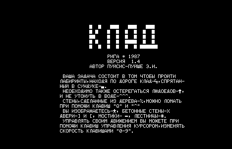
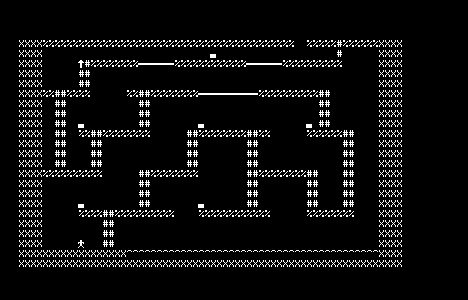

# Дизассемблирование игры КЛАД

*[In English](README.en.md)*

Восстановленный исходник на ассемблере Intel 8080 для `tape/KLAD.RK` —
лабиринт-игры **КЛАД** для Радио-86РК (1987 г., версия 1.4, автор
Э. Пуйсис-Пуйше, Рига). Программа загружается по адресу `org 0000h`.
`KLAD.asm` ассемблируется в побайтно идентичную копию ленты;
проверяется командой `just ci`.

▶ **Запустить оригинал в браузере**:
[rk86.ru/index.html?run=KLAD.RK](https://rk86.ru/index.html?run=KLAD.RK)

## Превью

| Заставка                       | Уровень 0                        |
|--------------------------------|----------------------------------|
|       |         |

Заставка — это текст приветствия и инструкции, отрендеренный из
одной строки в 644 байта по адресу `0x1612` (декодирована в
[`extracted/intro.screen.txt`](extracted/intro.screen.txt)). Уровень 0
рисуется из 41 записи, начиная с `0x18B0` (полный список записей и
ASCII-рендер — в
[`extracted/levels/level_00.txt`](extracted/levels/level_00.txt)).

## Цель проекта

Это учебный проект. Задача — разобраться, как устроена небольшая игра
1987 года для i8080: формат уровней, отрисовка плиток, поведение
противников, как через PPI магнитофона выводится звук, — разобрав
ленту байт за байтом и собрав её обратно в читаемый источник, который
ассемблируется в те же самые байты.

**Все права на оригинальную игру КЛАД (дизайн уровней, экранные
тексты, программный код) принадлежат автору, Э. Пуйсису-Пуйше.**
Образ ленты используется здесь исключительно для изучения и обратной
инженерии. Лицензия MIT в файле [`LICENSE`](LICENSE) распространяется
только на новую работу в этом репозитории — аннотированный исходник,
скрипты, документацию и текстовые выгрузки.

## Структура

```text
tape/KLAD.RK           оригинальный файл ленты (не изменять)
KLAD.bin               извлечённая полезная нагрузка (можно пересоздать из ленты)
KLAD.asm               аннотированный исходник (основной результат работы)
disasm.py              линейный дизассемблер i8080
tobin.py               распаковщик "обёртки" ленты
extract.py             выгрузка приветствия и карт уровней в текст
Justfile               сборка / проверка
extracted/             текстовые выгрузки от extract.py
  intro.screen.txt     декодированный экран приветствия (кириллица)
  intro.raw.txt        он же с раскрытыми управляющими кодами
  glyph_lut.txt        таблица "тип → глиф"
  levels/level_NN.txt  ASCII-рендер каждого уровня
```

## Команды

```bash
just ci                # ассемблирует KLAD.asm и сравнивает байты с лентой
                       # пустой diff = всё в порядке
just initial           # пересобрать KLAD.bin из tape/ (редко)
just disasm            # пересоздать KLAD.asm из KLAD.bin
                       # ВНИМАНИЕ: затирает ваши пометки — закоммитьте сначала
just clean             # удалить сгенерированные файлы
python3 extract.py     # пересобрать всё под extracted/
```

## Статус

- [x] Проход 0 — побайтное соответствие (линейный дизасм + `--trailer-padding 1`
      из-за off-by-1 в кодировщике этой ленты)
- [x] Проход 1 — разделение кода и данных (уровни, строка приветствия,
      BSS, таблица акторов, рабочие переменные — всё по своим местам)
- [x] Проход 2 — семантические метки (точки входа переименованы; каждая
      переменная стоит на своём адресе со своим именем)
- [x] Проход 3 — аннотация процедур (все вызываемые из реального кода
      процедуры получили смысловые имена; оставшиеся метки `loc_XXXX` —
      это адреса базовых блоков внутри переименованных процедур)

## Особенность ленты

Оригинальный кодировщик записал `end_addr = 334Fh`, но добавил один
лишний байт перед трейлером, оставив 1 нулевой байт между концом
объявленной нагрузки и `E6 cs_hi cs_lo`. Исходник усечён до 13136
байт, а `bunx asm8080 --trailer-padding 1` воспроизводит этот зазор.

## Формат уровня

Каждый уровень — это поток 5-байтных записей, которые рендерер в
`loc_0144` интерпретирует как заполненные прямоугольники, плюс
13-байтный "хвост" с метаданными старта. Полный формат:

### Таблица указателей (`tbl_01D0`)

19 little-endian слов-указателей по адресу `0x01D0`, индексируется
как `level_num × 2`:

```asm
tbl_01D0:
        dw   level_0      ; вход 0  (0x18B0)
        dw   level_1      ; вход 1  (0x0B35 — спрятан в "дырке")
        dw   level_2      ; вход 2  (0x1987)
        ...
        dw   level_18     ; вход 18 (0x3250)
```

Уровни 0 и 2–18 идут подряд в `0x18B0–0x334F`. Уровень 1 живёт
обособленно в `0x0B35`, в "мёртвой зоне" между главным циклом
(заканчивается в `0x0B34`) и подпрограммой по `0x0E4A` — видимо,
автор пристроил его туда, когда поздний адресный блок переполнился.

### Формат записи

Каждая запись — 5 байт:

```text
+0  type       индекс в tbl_01B2 → байт глифа
+1  row_start  начальная строка, включительно (0..23)
+2  row_end    конечная строка, включительно
+3  col_start  начальный столбец, включительно (0..63)
+4  col_end    конечный столбец, включительно
```

Рендерер заполняет прямоугольник (rs..re, cs..ce) глифом данного
типа, записывая и в видеопамять (через `plot_char`), и в теневую
карту в RAM `maze_map` (чтобы тесты столкновений могли читать
состояние клеток). Запись с `type == 0` завершает поток.

### Коды типов (`tbl_01B2`)

30-байтная таблица перекодировки по адресу `0x01B2` переводит код
типа в байт, выводимый на экран:

| Тип    | Глиф  | Значение                                       |
|--------|-------|------------------------------------------------|
| 0      | —     | завершитель потока                             |
| 1      | Х     | бетонная стена (неразрушимая)                  |
| 2      | #     | лестница                                       |
| 3      | ]     | дверь (закрывающаяся)                          |
| 4      | [     | дверь (открывающаяся)                          |
| 5      | ^     | вода                                           |
| 6      | ─     | мостик                                         |
| 7, 8   | ▄     | сундук                                         |
| 11     | %     | деревянная стена (ломается клавишами Q / ^)    |
| 18     | ⌐     | золотая монета (клад)                          |
| 19     | ✿     | игрок                                          |
| 20     | ↑     | людоед                                         |

Плюс несколько записей под глифы счёта и оформления.

### Хвост уровня (13 байт)

Сразу за байтом `type=0` подпрограмма `load_level_state` копирует 13
байт в "живые" переменные по адресам `0x08B1..0x08BD`:

```text
+0    player_x_init     (использует слот row_start завершающей записи)
+1    player_y_init     (слот row_end завершающей записи)
+2..3 actor0_init       \
+4..5 actor1_init        | пары word — стартовые xy до 4 акторов
+6..7 actor2_init        |
+8..9 actor3_init       /
+A    actor_count       сколько из 4 акторов активны
+B    goal_x            столбец сундука
+C    goal_y            строка сундука
```

Первые 4 байта хвоста "едут" как параметры завершающей записи
(то есть метка конца уровня одновременно служит точкой появления
игрока); остальные 9 байт лежат в зазоре до начала следующего
уровня.

### Пример: уровень 0

```asm
level_0:                                  ; 0x18B0
        db   01h, 01h, 17h, 00h, 03h      ; стена  стр 1-23  стлб  0-3   (левый край)
        db   01h, 16h, 17h, 00h, 3Fh      ; стена  стр 22-23 стлб  0-63  (низ)
        db   01h, 01h, 17h, 3Ch, 3Fh      ; стена  стр 1-23  стлб 60-63  (правый край)
        db   05h, 16h, 16h, 12h, 3Bh      ; вода   стр 22    стлб 18-59
        db   02h, 12h, 15h, 0Eh, 0Fh      ; лест.  стр 18-21 стлб 14-15
        db   0Bh, 12h, 12h, 0Ah, 0Dh      ; дерево стр 18    стлб 10-13
        db   07h, 11h, 11h, 0Ah, 0Ah      ; сундук стр 17    стлб  10
        ...
        db   00h                          ; завершитель (type=0)
        db   0Fh, 04h                     ; старт игрока (15, 4)
        db   01h, 2Eh, 00h, 00h, ...      ; хвост: акторы / цель
```

Запустите `python3 extract.py` и посмотрите
`extracted/levels/level_00.txt` — там полный список записей и
ASCII-рендер.

### Загрузчик (`loc_0100`)

```asm
loc_0100:
        mvi  c, 1Fh
        call putc                  ; очистить экран
        lxi  h, tbl_01D0
        xra  a
        lda  level_num
        ral                        ; A = level_num × 2
        mov  e, a
        mvi  d, 00h
        dad  d                     ; HL = tbl_01D0 + level_num*2
        mov  a, m
        sta  level_ptr
        inx  h
        mov  a, m
        sta  level_ptr+1
        lxi  h, maze_map
        shld maze_map_base
loc_0120:                          ; цикл записей (см. "Формат записи")
        ...
```

После возврата из цикла записей `game_restart` вызывает
`load_level_state` для чтения хвоста, затем заполняет `player_x` /
`player_y` и копирует 4 стартовые позиции акторов в "живые"
структуры `actor0..actor3`.

## Инструменты

- `bunx asm8080` — ассемблер (<https://github.com/begoon/asm8>)
- `python3` — для `disasm.py`, `tobin.py`, `extract.py`
- `just` — менеджер задач
- `xxd` и `diff` — проверка побайтного соответствия

## Справочные материалы

Описание процесса обратной разработки, шпаргалка идиом и аппаратный
справочник по РК-86 живут в репозитории навыка под
[`rk86-skills/rk86-reversal/`](https://github.com/begoon/rk86-reversal).

## Лицензия

[MIT](LICENSE) — на работу по обратной инженерии в этом репозитории.
Все права на оригинальную игру КЛАД 1987 года остаются за её
автором, Э. Пуйсисом-Пуйше.
